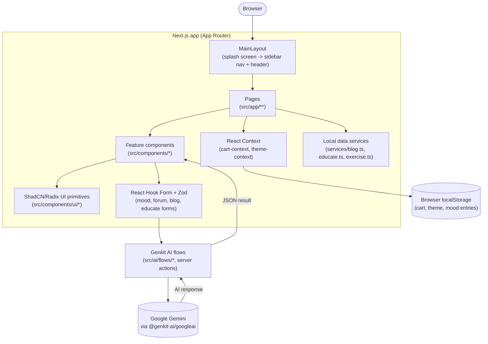

# MomEase


A pregnancy and postpartum companion app built with Next.js — mood tracking, an AI chat companion, an AI-generated weekly pregnancy progress tracker, trimester-specific exercises, educational articles, a community forum, and a small shop, all in one calming, single-page-app-style dashboard.

There's no backend/database yet: the app runs entirely client-side, with sample content shipped in-repo and per-browser state (cart, theme, mood entries) kept in `localStorage`. See [How it can be improved](#how-it-can-be-improved) for where a real backend would plug in.

## Features

- An AI companion and mood tracker that logs daily moods and symptoms and visualizes trends over time
- An exercises and well-being hub with trimester-specific physical exercises and mental well-being resources
- An educate section with categorized articles on pregnancy, nutrition, vaccination, and child care, including AI-generated article summaries
- A due date calculator and AI-generated weekly pregnancy progress updates (baby development, mother's changes, a size comparison, and actionable tips per week)
- A community forum and FAQ section
- An ambient music player with calming soundscapes
- A directory for finding professional help such as OB/GYNs and postpartum therapists
- A shop with cart functionality (persisted to `localStorage`) for browsing and purchasing baby and mother essentials
- Light/dark mode with a saved preference, and a collapsible sidebar with a glassmorphism style

## Architecture



Each AI feature (mood support suggestions, weekly pregnancy updates, expert blog summaries) is a typed Genkit flow under `src/ai/flows/`: a Zod schema defines the input/output shape, a prompt template is sent to Gemini, and the flow is invoked as a Next.js server action directly from the relevant client component — no separate API route needed. Everything else (blog/educate/exercise content, the shop catalog) is static sample data served through a thin `services/` layer, standing in for a future real backend.

## Tech Stack

- **Framework**: Next.js 15 (App Router, Turbopack in dev)
- **Language**: TypeScript
- **UI**: ShadCN UI components on top of Radix UI primitives, Tailwind CSS (with `tailwindcss-animate`), Lucide React icons, Geist font
- **AI**: Genkit (`genkit`, `@genkit-ai/next`) with the Google AI plugin (`@genkit-ai/googleai`), model `gemini-2.0-flash`
- **Forms & validation**: React Hook Form with `@hookform/resolvers`, Zod schemas
- **Charts**: Recharts (mood trend visualization)
- **Dates**: date-fns, `react-day-picker`
- **State**: React Context for cross-cutting state (cart, theme); `localStorage` for client-side persistence
- **Tooling**: ESLint, `patch-package`, `tsx`

## Prerequisites

- Node.js and npm
- A Google AI Studio API key (`GOOGLE_API_KEY`) to power the Genkit/Gemini AI features — mood support suggestions, weekly pregnancy updates, and blog summaries all call out to Gemini and will fail without one

## Installation

```bash
npm install
```

## Configuration

Create a `.env` file in the project root with:

```bash
GOOGLE_API_KEY=<your Google AI Studio API key>
```

This is the only environment variable the app currently reads (via `dotenv` in `src/ai/dev.ts` and Next.js' built-in `.env` support) — it's required for every Genkit flow to reach Gemini.

## Usage

```bash
npm run dev            # start the Next.js dev server (Turbopack) on http://localhost:9002
npm run build           # production build
npm start                # run the production build
npm run genkit:dev      # start the Genkit dev UI to inspect/test AI flows directly
npm run genkit:watch    # same, but restarts on file changes
npm run lint             # next lint
npm run typecheck        # tsc --noEmit
```

## The process

This was a team project built by Team Coin Toss, with Mohammed Shahzad Anwar as project lead and full-stack developer, Syed Yaseenuddin focused on the frontend and UI/UX, Mohammed Ali Khan on backend and AI integration, and Sohail Mohammed Ayan on QA and content. Bringing together so many different feature areas (AI chat, tracking, a forum, a shop) under one consistent design system was the main challenge, which is why a shared UI library (ShadCN) and a single styling approach (Tailwind) mattered for keeping the app coherent across sections.

## What I learned

- Building and styling a large multi-feature app with a shared component library and consistent design system
- Working within a team, with each person owning a different area of the app (frontend, backend/AI, QA)
- Integrating generative AI (Genkit with Gemini models) for chat, summarization, and personalized content
- Using React Context for cross-cutting state like theme and cart, separate from page-level state
- Validating forms with React Hook Form and Zod

## How it can be improved

- Move from localStorage and in-repo sample data to a real backend and database so data persists across devices
- Build out a full e-commerce backend for the shop instead of a demo checkout
- Add real-time chat to the community forum
- Add appointment reminders and personalized exercise or meal plans
- Add automated tests and CI, and wire up the currently-unused `firebase`/`@tanstack/react-query` dependencies (or remove them) once a real backend exists

## Project Structure

```
MomEase/
├── docs/
│   └── blueprint.md                       # Original app concept/design brief
├── src/
│   ├── ai/
│   │   ├── genkit.ts                      # Genkit client config (Google AI plugin, gemini-2.0-flash)
│   │   ├── dev.ts                         # Genkit dev-server entry point, registers all flows
│   │   └── flows/
│   │       ├── mood-analysis-and-support.ts     # AI chatbot support suggestions from mood/symptoms
│   │       ├── pregnancy-weekly-update.ts       # AI-generated weekly pregnancy update
│   │       └── expert-blog-summary.ts           # AI summary of a blog/educate article
│   ├── app/                               # Next.js App Router pages (one folder per route)
│   │   ├── ai-companion/, ai-support/, mood-tracker/, exercises-wellbeing/,
│   │   │   educate/, growth/, community/, ambient-music/, professional-help/, shop/, ...
│   │   └── layout.tsx, page.tsx, globals.css
│   ├── components/
│   │   ├── layout/                        # main-layout, app-header, app-footer, sidebar-nav
│   │   ├── ui/                             # ShadCN/Radix UI primitives (button, card, dialog, ...)
│   │   └── *.tsx                           # Feature components (mood-chart, forum-list, exercise-card, ...)
│   ├── context/
│   │   ├── cart-context.tsx               # Shop cart state, persisted to localStorage
│   │   └── theme-context.tsx              # Light/dark theme state, persisted to localStorage
│   ├── services/
│   │   ├── blog.ts, educate.ts, exercise.ts   # Sample content + accessor functions (stand-in for a real backend)
│   ├── config/
│   │   └── nav-links.ts                   # Sidebar navigation link definitions
│   ├── hooks/                             # use-toast, use-mobile
│   ├── types/                             # Shared types (mood.ts, shop.ts)
│   └── lib/utils.ts                       # Shared utilities (e.g. `cn` class merging)
├── next.config.ts
├── tailwind.config.ts
└── tsconfig.json
```

## Linting

```bash
npm run lint
```
